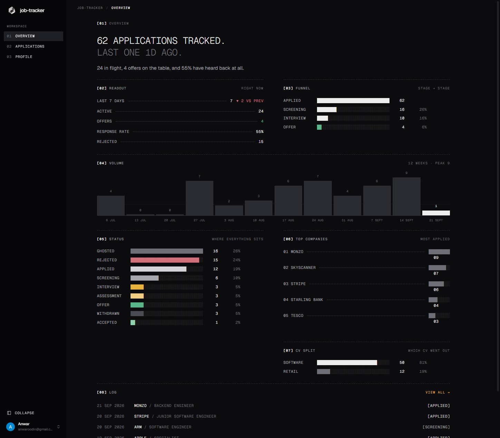
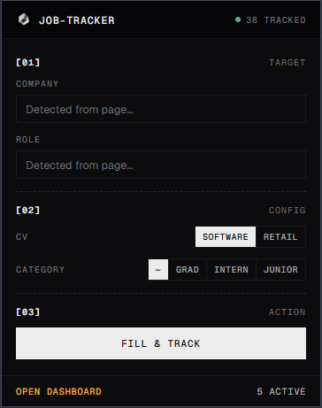

<div align="center">
  
  <h1>job-tracker</h1>
  <p>A personal job-application tracker built on React Router 7 and deployed to Cloudflare Workers.</p>
</div>

---

## Overview

**job-tracker** is a blazingly fast, highly-customizable personal CRM for tracking your job applications, CV files, and upcoming interviews. It utilizes a modern edge-based tech stack, keeping everything serverless and instantly responsive.

<div align="center">
  
  <p>Overview Page</p>
</div>

The core of the experience revolves around the **companion browser extension** which acts as your personal job hunting assistant:

- **Auto-Fill:** Instantly populates complex application forms with your saved profile and CV data.
- **One-Click Save:** Automatically detects and saves job descriptions, titles, and company names while you browse.
- **Email Tracking:** Integrates with your inbox to automatically classify application-related emails, track interview stages, and update application statuses.
- **Timelines & Analytics:** Creates detailed chronologies of your interactions with companies and provides rich analytics on your application conversion rates.

### Gmail integration

Connect Gmail (read-only) and job-tracker syncs application emails in the background:

- **Classification:** each email is labelled as applied, screening, interview, assessment, offer, rejected or other, and application statuses follow along. Uses built-in keyword rules by default, or [TypeSafe's Jev model](https://docs.typesafe.ai) when an API key is set. Low-confidence answers are marked *unsure* and don't change a status until you confirm them.
- **Corrections:** re-label, confirm or unlink any email from an application's timeline.
- **Dates, links and replies (Jev):** pulls out interview times and deadlines, adds a button to join the meeting or open the assessment, and flags emails waiting on your reply. These show on the timeline and in the overview's *Up next*.
- **Untracked applications:** confirmation emails for jobs you haven't added are suggested on the Applications page, with the company and role filled in where they can be found.
- **Usage & settings:** a usage page tracks Jev spend against an optional monthly budget, and a settings page controls the classifier, confidence threshold and syncing.

<div align="center">
  
  <p>Browser Extension</p>
</div>

## Tech Stack

- **Framework:** [React Router 7](https://reactrouter.com/) (Framework Mode)
- **Deployment:** [Cloudflare Workers](https://workers.cloudflare.com/)
- **Database:** Cloudflare D1 (SQLite) via [Drizzle ORM](https://orm.drizzle.team/)
- **Storage:** Cloudflare R2 (CV PDFs)
- **Sessions:** Cloudflare KV
- **Authentication:** [Better Auth](https://better-auth.com/) + Google OAuth
- **Styling:** Tailwind CSS v4 & Radix UI primitives

## Project Structure

```text
job-tracker/
├── app/
│   ├── app.css                 Tailwind v4 @theme configuration
│   ├── root.tsx                Root layout & font loading
│   ├── routes.ts               Route table mapping
│   ├── env.d.ts                Cloudflare Env type definitions
│   ├── routes/
│   │   ├── index.tsx           Session-based redirect
│   │   ├── api/                API Endpoints (Auth splat & browser extension API)
│   │   ├── auth/               Login & Logout routes
│   │   └── app/                Authed App Shell (Overview, Applications, Profile, Usage, Settings)
│   ├── components/             Atomic design system (Atoms, Molecules, Organisms)
│   ├── lib/                    Client-side utilities & global state
│   └── server/                 Backend configuration
│       ├── db/                 Drizzle schema, clients, and data access layer
│       ├── email/              Email classification, detail and suggestion candidates
│       ├── gmail/              Gmail API client and background sync
│       ├── jev/                TypeSafe Jev questions (optional AI classification)
│       └── *.server.ts         Auth, R2, and Extension API utilities
├── workers/
│   └── app.ts                  Cloudflare Worker entry point
└── migrations/                 Drizzle SQL migrations
```

## Local Setup

```bash
git clone https://github.com/yourusername/job-tracker.git
cd job-tracker
npm install
```

### 1. Create Cloudflare Resources (Once per environment)

```bash
npx wrangler d1 create job-tracker-db
npx wrangler kv namespace create SESSIONS
npx wrangler r2 bucket create job-tracker-cvs
```

Copy the returned IDs into your `wrangler.jsonc` file, replacing the `REPLACE_WITH_*` placeholders.

### 2. Generate & Apply D1 Migrations

```bash
npm run db:generate            # Drizzle → SQL in ./migrations
npm run db:migrate:local       # Apply to local D1 (used by `npm run dev`)
npm run db:migrate:remote      # Apply to production D1
```

### 3. Set Secrets

Set up your production secrets:

```bash
npx wrangler secret put SESSION_SECRET        # any 32+ byte random string
npx wrangler secret put GOOGLE_CLIENT_ID
npx wrangler secret put GOOGLE_CLIENT_SECRET
npx wrangler secret put ALLOWED_EMAILS        # optional, comma-separated list
npx wrangler secret put TYPESAFE_API_KEY      # optional, enables Jev classification
```

Without `TYPESAFE_API_KEY`, emails are classified with the built-in keyword rules and the Jev-only features (dates, links, reply flags) are skipped. To keep a key set but turn Jev off, add `"EMAIL_CLASSIFIER": "regex"` to `vars` in `wrangler.jsonc`.

For **local development**, create a `.dev.vars` file in the root directory:

```env
SESSION_SECRET=dev-secret-please-change
GOOGLE_CLIENT_ID=your_google_client_id
GOOGLE_CLIENT_SECRET=your_google_client_secret
ALLOWED_EMAILS=you@example.com
TYPESAFE_API_KEY=                 # optional
```

### 4. Configure Google OAuth

1. Go to [Google Cloud Console → APIs & Services → Credentials](https://console.cloud.google.com/apis/credentials).
2. Create an **OAuth 2.0 Client (Web application)**.
3. Add the following authorized redirect URIs:
   - `http://localhost:5173/api/auth/callback/google`
   - `https://<your-worker-subdomain>.workers.dev/api/auth/callback/google`
4. Set the `APP_URL` in `wrangler.jsonc` (`vars`) to your production origin (Better Auth uses this as the base URL).

### 5. Run the Application

```bash
npm run dev       # Start local dev server at http://localhost:5173
npm run deploy    # Build and deploy to Cloudflare Workers
```

## Roadmap

- [ ] Support CV upload/download via R2 signed URLs
- [x] Gmail integration for automatic follow-up tracking
- [ ] Browser extension companion app interacting with the Workers API
- [ ] Data importer for legacy JSON job tracking formats

## Contributing

Contributions are welcome! Please feel free to submit a Pull Request. By participating in this project, you agree to abide by standard open source community guidelines.
