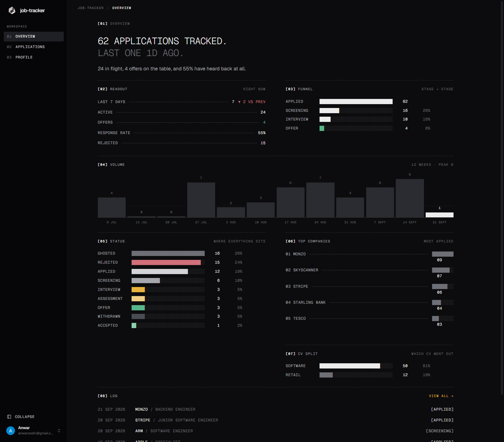
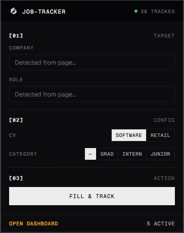

<div align="center">
  
  <h1>job-tracker</h1>
  <p>A personal job-application tracker built on React Router 8 and deployed to Cloudflare Workers.</p>
</div>

---

## Overview

**job-tracker** is a blazingly fast, highly-customizable personal CRM for tracking your job applications, CV files, and upcoming interviews. It utilizes a modern edge-based tech stack, keeping everything serverless and instantly responsive.

<div align="center">
  
  <p>Overview Page</p>
</div>

The core of the experience revolves around the **companion browser extension** which acts as your personal job hunting assistant:

- **Auto-Fill:** Instantly populates complex application forms with your saved profile and CV data.
- **One-Click Save:** Automatically detects and saves job descriptions, titles, and company names while you browse.
- **Email Tracking:** Integrates with your inbox to automatically classify application-related emails, track interview stages, and update application statuses.
- **Timelines & Analytics:** Creates detailed chronologies of your interactions with companies and provides rich analytics on your application conversion rates.

### Gmail integration

Connect Gmail (read-only) and job-tracker syncs application emails in the background:

- **Classification:** each email is labelled as applied, screening, interview, assessment, offer, rejected or other, and application statuses follow along. Uses built-in keyword rules by default, or [TypeSafe's Jev model](https://docs.typesafe.ai) when an API key is set. Low-confidence answers are marked *unsure* and don't change a status until you confirm them.
- **Corrections:** re-label, confirm or unlink any email from an application's timeline.
- **Dates, links and replies (Jev):** pulls out interview times and deadlines, adds a button to join the meeting or open the assessment, and flags emails waiting on your reply. These show on the timeline and in the overview's *Up next*.
- **Untracked applications:** confirmation emails for jobs you haven't added are suggested on the Applications page, with the company and role filled in where they can be found.
- **Usage & settings:** a usage page tracks Jev spend against an optional monthly budget, and a settings page controls the classifier, confidence threshold and syncing.
- **Privacy:** only job-related email is kept. Once an email is known not to be about jobs, its subject, sender and snippet are deleted, and only its Gmail id, thread and date remain so it isn't downloaded again. Emails Jev isn't sure about are kept and listed on the Applications page until you mark them as not about jobs (which deletes them) or give them a category. Emails in the same thread as a job email are kept, and a removed email is fetched again if a job email later joins its thread or the classifier changes.

<div align="center">
  
  <p>Browser Extension</p>
</div>

## Tech Stack

- **Framework:** [React Router 8](https://reactrouter.com/) (Framework Mode)
- **Deployment:** [Cloudflare Workers](https://workers.cloudflare.com/)
- **Database:** Cloudflare D1 (SQLite) via [Drizzle ORM](https://orm.drizzle.team/)
- **Storage:** Cloudflare R2 (CV PDFs)
- **Sessions:** Cloudflare KV (read on every request; D1 keeps a copy)
- **Authentication:** [Better Auth](https://better-auth.com/) + Google OAuth
- **Styling:** Tailwind CSS v4 & Radix UI primitives

## Project Structure

```text
job-tracker/
├── app/
│   ├── app.css                 Tailwind v4 @theme configuration
│   ├── root.tsx                Root layout & font loading
│   ├── routes.ts               Route table mapping (the only one)
│   ├── routes/                 Route modules only: loader, action and page
│   │   ├── api/                Auth splat, extension API, activity, search, Gmail status
│   │   ├── auth/               Login & logout
│   │   └── app/                Authed shell (layout resolves the user once per request) and its pages
│   ├── components/             All components, grouped by feature
│   │   ├── ui/                 Generic building blocks (Button, Input, terminal blocks, StatusBadge)
│   │   ├── shell/              Sidebar, activity feed, command palette
│   │   └── gmail/ overview/ applications/ application-detail/ profile/ settings/
│   ├── hooks/                  Generic React hooks
│   ├── types/                  Types shared by the server and the UI
│   ├── lib/                    Client-safe helpers, constants and client state
│   └── server/                 Server-only code (never imported by components)
│       ├── auth/               Better Auth config, sessions (KV), allowlist
│       ├── db/                 Drizzle client, schema/ (one file per table), queries/ (the only place SQL lives)
│       ├── services/           Business rules: status transitions, applications, timeline, overview, search
│       ├── email/              Classification, retention (privacy rules), details, suggestions
│       ├── gmail/              Gmail API client, payload mapping, sync/ (the sync pipeline)
│       ├── jev/                TypeSafe Jev questions (optional AI classification)
│       ├── storage/            R2 helpers (CV uploads, upcoming)
│       └── extension/          Extension API HTTP helpers and input validation
├── test/                       Vitest suite (npm test), runs against the real migrations
├── extension/                  Chrome extension (see extension/README.md)
├── workers/
│   └── app.ts                  Cloudflare Worker entry point
├── migrations/                 Drizzle SQL migrations
└── docs/                       Architecture, development and refactor notes
```

## Local Setup

```bash
git clone https://github.com/yourusername/job-tracker.git
cd job-tracker
npm install
```

### 1. Create Cloudflare Resources (Once per environment)

```bash
npx wrangler d1 create job-tracker-db
npx wrangler kv namespace create SESSIONS
npx wrangler r2 bucket create job-tracker-cvs
```

Copy the returned IDs into your `wrangler.jsonc` file, replacing the `REPLACE_WITH_*` placeholders.

### 2. Generate & Apply D1 Migrations

```bash
npm run db:generate            # Drizzle → SQL in ./migrations
npm run db:migrate:local       # Apply to local D1 (used by `npm run dev`)
npm run db:migrate:remote      # Apply to production D1
```

### 3. Set Secrets

Set up your production secrets:

```bash
npx wrangler secret put SESSION_SECRET        # any 32+ byte random string
npx wrangler secret put GOOGLE_CLIENT_ID
npx wrangler secret put GOOGLE_CLIENT_SECRET
npx wrangler secret put ALLOWED_EMAILS        # optional, comma-separated list
npx wrangler secret put TYPESAFE_API_KEY      # optional, enables Jev classification
```

Without `TYPESAFE_API_KEY`, emails are classified with the built-in keyword rules and the Jev-only features (dates, links, reply flags) are skipped. To keep a key set but turn Jev off, add `"EMAIL_CLASSIFIER": "regex"` to `vars` in `wrangler.jsonc`.

For **local development**, create a `.dev.vars` file in the root directory:

```env
SESSION_SECRET=dev-secret-please-change
GOOGLE_CLIENT_ID=your_google_client_id
GOOGLE_CLIENT_SECRET=your_google_client_secret
ALLOWED_EMAILS=you@example.com
TYPESAFE_API_KEY=                 # optional
```

### 4. Configure Google OAuth

1. Go to [Google Cloud Console → APIs & Services → Credentials](https://console.cloud.google.com/apis/credentials).
2. Create an **OAuth 2.0 Client (Web application)**.
3. Add the following authorized redirect URIs:
   - `http://localhost:5173/api/auth/callback/google`
   - `https://<your-worker-subdomain>.workers.dev/api/auth/callback/google`
4. Set the `APP_URL` in `wrangler.jsonc` (`vars`) to your production origin (Better Auth uses this as the base URL).

### 5. Run the Application

```bash
npm run dev       # Start local dev server at http://localhost:5173
npm test          # Run the test suite
npm run deploy    # Build and deploy to Cloudflare Workers
```

### 6. Load the Browser Extension

Load the `extension/` folder unpacked from `chrome://extensions`, click its icon and enter your dashboard's address (your Worker's URL), then sign in on the dashboard. See [extension/README.md](./extension/README.md) for details.

## Roadmap

- [ ] Support CV upload/download via R2 signed URLs
- [x] Gmail integration for automatic follow-up tracking
- [x] Browser extension companion app interacting with the Workers API
- [ ] Data importer for legacy JSON job tracking formats

## Contributing

Contributions are welcome! Please feel free to submit a Pull Request. By participating in this project, you agree to abide by standard open source community guidelines.
